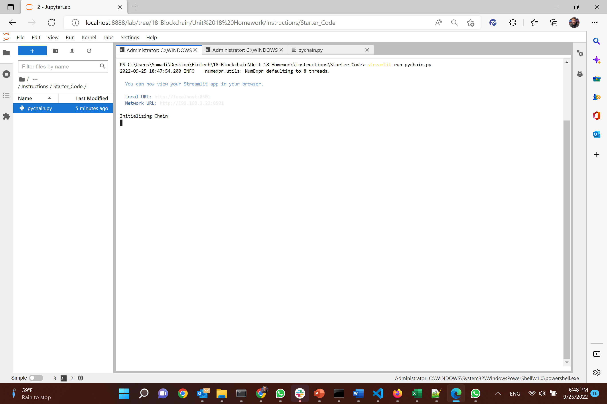
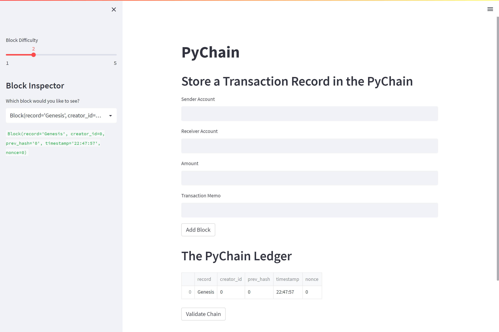
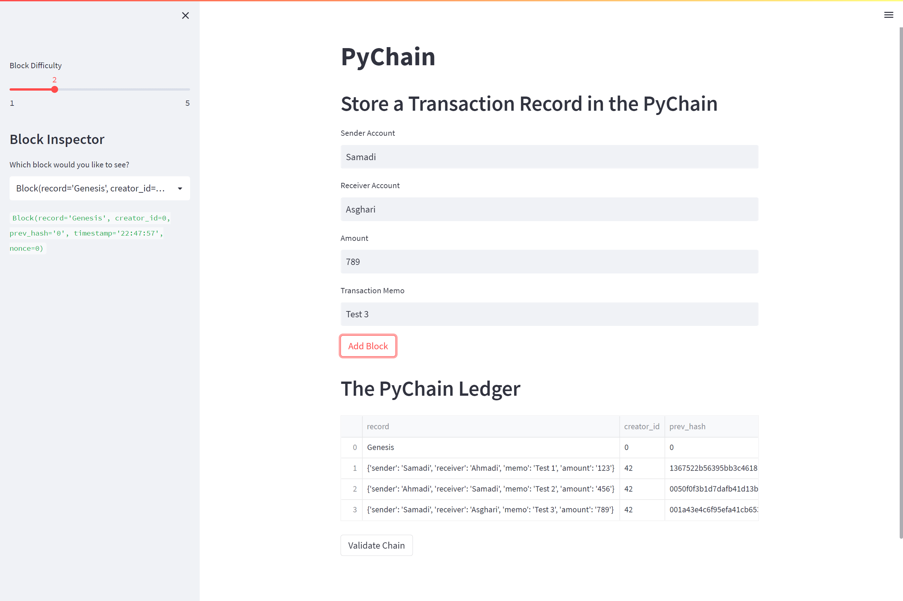
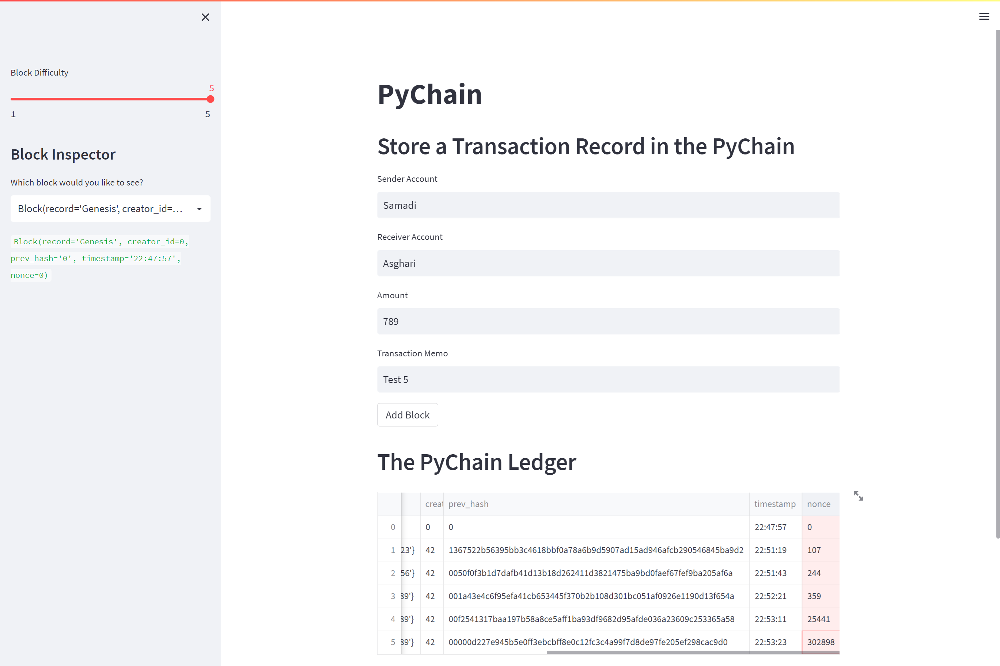
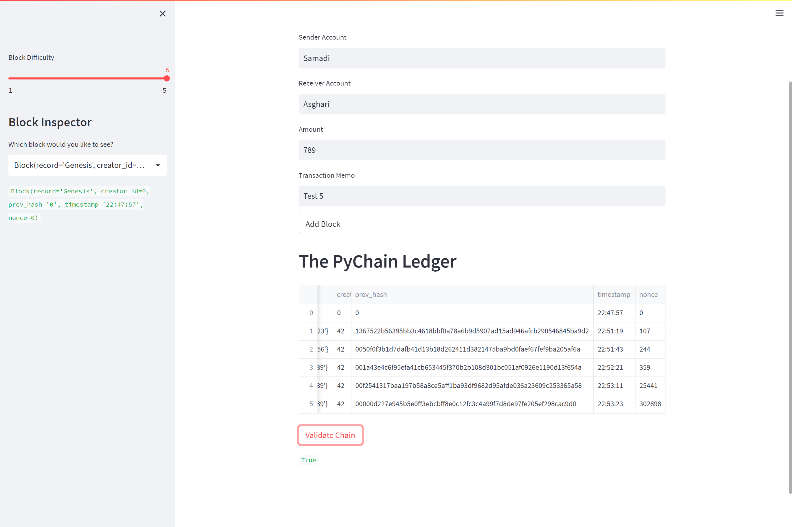

# PyChain Ledger

I did following steps for this assignment:
# Step 1: Create a Record Data Class
    @dataclass
    class Record:
        sender: str
        receiver: str
        memo: str
        amount: float 

# Step 2: Modify the Existing Block Data Class to Store Record Data

    @dataclass
    class Block:
        record: Record
        creator_id: int
        prev_hash: str = "0"
        timestamp: str = datetime.datetime.utcnow().strftime("%H:%M:%S")
        nonce: int = 0

# Step 3: Add Relevant User Inputs to the Streamlit Interface

    tr_sender = st.text_input("Sender Account")

    tr_receiver = st.text_input("Receiver Account")

    tr_amount = st.text_input("Amount")

    tr_memo = st.text_input("Transaction Memo")

    if st.button("Add Block"):
        prev_block = pychain.chain[-1]
        prev_block_hash = prev_block.hash_block()

        new_record= Record(
            sender=tr_sender,
            receiver=tr_receiver,
            memo=tr_memo,
            amount=tr_amount)

        new_block = Block(
            record = new_record, 
            creator_id=42,
            prev_hash=prev_block_hash
        )

        pychain.add_block(new_block)
        st.balloons()

# Step 4: Test the PyChain Ledger by Storing Records

1. Run Application 

2. Streamlit UI

3. Add transactions

4. Add transaction with higher difficulty 

5. Verfiy the Chain

## Files
[PyChain.py](PyChain.py)